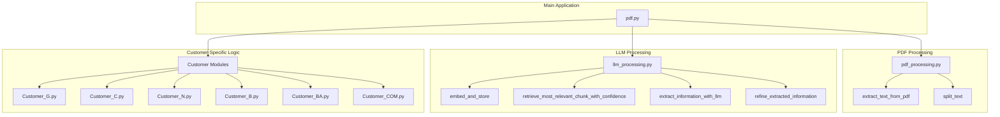

# PDF Purchase Order Processing API

A Flask-based API for extracting and processing purchase order information from PDF documents. This application uses natural language processing and machine learning techniques to automatically extract key information from purchase order PDFs and return structured data.

## Features

- PDF document upload and processing
- Customer-specific extraction logic
- Text extraction from PDFs
- LLM-based information extraction with confidence scoring
- Data refinement and formatting
- RESTful API endpoints
- Cross-Origin Resource Sharing (CORS) support

## Module Relationships

The application consists of several interconnected modules, each with specific responsibilities:



### Module Descriptions

- **pdf.py**: Main Flask application that handles HTTP requests, routes, and orchestrates the PDF processing workflow
- **pdf_processing.py**: Contains utilities for extracting and processing text from PDF files
  - `extract_text_from_pdf`: Extracts raw text from PDF documents
  - `split_text`: Divides extracted text into manageable chunks
- **llm_processing.py**: Provides functions for language model processing
  - `embed_and_store`: Converts text chunks into embeddings and stores them
  - `retrieve_most_relevant_chunk_with_confidence`: Finds the most relevant text based on a query
  - `extract_information_with_llm`: Uses LLM to extract structured information
  - `refine_extracted_information`: Refines the extracted information using prompts
- **Customer Modules**: Customer-specific configuration and processing logic
  - Each customer module contains:
    - `extract_prompt`: Initial extraction prompt
    - `refine_prompt`: Refinement prompt
    - `sold_to_info`: Customer sold-to information
    - `ship_to_info`: Customer shipping location mappings

## Prerequisites

- Python 3.7+
- Flask
- Flask-CORS
- Werkzeug
- Various NLP/ML libraries (for embedding and LLM processing)
- Customer-specific processing modules

## Installation

1. Clone the repository:
   ```
   git clone <repository-url>
   cd <repository-directory>
   ```

2. Install required dependencies:
   ```
   pip install -r requirements.txt
   ```

3. Ensure all customer modules are available in the project directory:
   - Customer_G.py
   - Customer_C.py
   - Customer_N.py
   - Customer_B.py
   - Customer_BA.py
   - Customer_COM.py

## Usage

### Starting the Server

Run the application:

```
python pdf.py
```

The server will start on http://localhost:5000 by default.

### API Endpoints

#### 1. Process Purchase Order

**Endpoint:** `/api/process-purchase-order`  
**Method:** POST  
**Content-Type:** multipart/form-data

**Parameters:**
- `file`: PDF file to process (required)
- `customer`: Customer code (e.g., 'BA', 'C', 'N', 'B', 'G', 'COM')

**Response:**
```json
{
  "Purchase Order Number": "PO123456",
  "Quantity": "1000",
  "Unit": "KG",
  "Required Delivery Date": "2025-03-15",
  "Material Number": "MAT001",
  "Deliver to": "Warehouse A"
}
```

#### 2. Get Customers List

**Endpoint:** `/api/customers`  
**Method:** GET

**Response:**
```json
[
  {"value": "C", "label": "Customer C"},
  {"value": "N", "label": "Customer N"},
  {"value": "B", "label": "Customer B"},
  {"value": "G", "label": "Customer G"},
  {"value": "BA", "label": "Customer BA"},
  {"value": "COM", "label": "Customer COM"}
]
```

## Processing Flow

1. **PDF Upload**: The PDF file is uploaded and temporarily stored
2. **Text Extraction**: Raw text is extracted from the PDF
3. **Text Chunking**: The text is split into manageable chunks
4. **Embedding**: Text chunks are embedded and stored in a vector database
5. **Relevant Text Retrieval**: The most relevant text chunks are retrieved based on the query
6. **Initial Information Extraction**: LLM extracts initial information from relevant text
7. **Refinement**: The extracted information is refined using customer-specific prompts
8. **Post-processing**: 
   - Quantity and unit formatting
   - Date format standardization
   - Adding sold-to information
   - Processing deliver-to addresses
9. **Response**: The structured information is returned as JSON

## Extending for New Customers

To add support for a new customer:

1. Create a new customer module (e.g., `Customer_NEW.py`) with:
   - `extract_prompt`: Prompt for initial information extraction
   - `refine_prompt`: Prompt for refining extracted information
   - `sold_to_info`: Dictionary with sold-to information
   - `ship_to_info`: Dictionary mapping delivery addresses

2. Import the new module in `pdf.py`

3. Add the new customer to the `customer_modules` dictionary in the `process_purchase_order` function

4. Add the new customer to the list returned by the `/api/customers` endpoint

## Error Handling

The API includes error handling for:
- Missing files
- Invalid file types
- Processing errors
- Invalid customer selections

## License

[Specify your license here]

## Contributors

[List contributors here]
