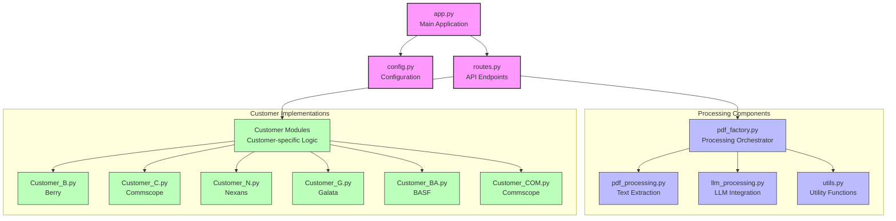
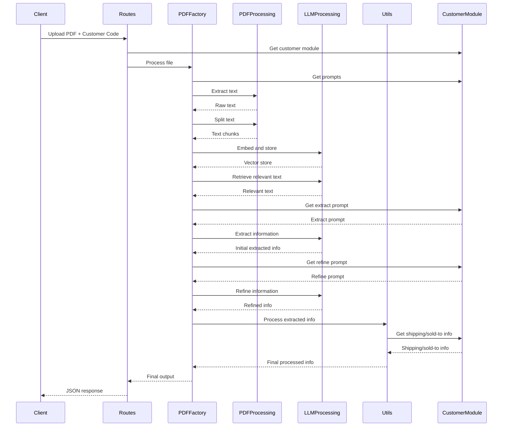

# PDF Processing Backend

This document explains the backend architecture and process flow of the PDF processing application.

## Architecture Overview

The PDF processing backend is a Flask-based web application that extracts and processes information from PDF purchase orders for various customers. The application follows a modular design with separate components for different aspects of the processing pipeline.

## Module Relationships



## Module Responsibilities

### 1. App.py
- Main entry point for the application
- Initializes the Flask app
- Sets up routes
- Starts the server

### 2. config.py
- Contains Flask app configuration
- Handles file validation
- Sets up upload directories

### 3. routes.py
- Defines API endpoints
- Manages customer modules
- Handles file uploads
- Processes HTTP requests and responses

### 4. pdf_factory.py
- Creates and manages PDF processing operations
- Orchestrates the processing pipeline
- Connects different processing components

### 5. pdf_processing.py
- Extracts text from PDF files
- Splits text into manageable chunks
- Handles customer-specific PDF processing logic

### 6. llm_processing.py
- Embeds text using language models
- Retrieves relevant chunks based on queries
- Extracts information using LLM
- Refines extracted information

### 7. utils.py
- Contains utility functions for data processing
- Matches delivery addresses
- Formats quantities and dates
- Processes extracted information

### 8. Customer Modules (Customer_B.py, Customer_C.py, etc.)
- Contain customer-specific data and logic
- Define extraction prompts
- Define refinement prompts
- Store shipping and sold-to information

## Process Flow

The PDF processing pipeline follows these steps:

1. **Request Handling**:
   - Client uploads a PDF file with a customer selection
   - The `/api/process-purchase-order` endpoint receives the request
   - The file is validated and saved temporarily

2. **Customer Module Selection**:
   - The appropriate customer module is selected based on the customer code
   - Customer-specific prompts and data are retrieved

3. **PDF Processing**:
   - Text is extracted from the PDF using pdf_processing.py
   - The text is split into manageable chunks
   - A vector store is created from the chunks using embeddings

4. **Information Extraction**:
   - Relevant text chunks are retrieved based on a query
   - Initial information is extracted using the customer's extract_prompt
   - The extracted information is refined using the customer's refine_prompt

5. **Post-Processing**:
   - Quantities and units are standardized
   - Dates are formatted consistently
   - Delivery addresses are matched to known shipping locations
   - Customer-specific sold-to information is added

6. **Response**:
   - The processed information is returned as JSON
   - The temporary file is deleted

## Detailed PDF Processing Pipeline



## Customer Modules

Each customer module contains:

1. **sold_to_info**: Dictionary with customer identification information
2. **ship_to_info**: Dictionary mapping shipping codes to addresses
3. **extract_prompt**: Function that generates a prompt for initial information extraction
4. **refine_prompt**: Function that generates a prompt for refining extracted information

Example (Customer_B.py):
```python
sold_to_info = {
    "sold_to_num": "bsp_222"  
}

ship_to_info = {
    "bsh_1": "123",
    "bsh_2": "222",
}

def extract_prompt(retrieved_text):
    return f"""
    You are an expert at reading purchase orders...
    """

def refine_prompt(extracted_info):
    return f"""
    You are an expert at processing purchase orders...
    """
```

## LLM Processing

The application uses Ollama's language models for:

1. **Embeddings**: Converting text chunks to vector representations
2. **Information Extraction**: Using LLM to extract structured information from text
3. **Information Refinement**: Using LLM to refine and format extracted information

## API Endpoints

1. **/api/process-purchase-order** (POST)
   - Processes a PDF purchase order
   - Requires a file upload and customer selection
   - Returns extracted and processed information as JSON

2. **/api/customers** (GET)
   - Returns a list of available customers
   - Used for populating customer selection dropdowns

## Running the Application

The application can be started by running:
```
python pdf.py
```

This starts a Flask server on port 5000 that accepts API requests for processing PDF purchase orders.
